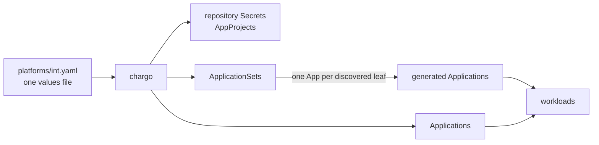

<p align="center">
  <a href="https://github.com/Yodatek/chargo/actions/workflows/ci.yml"></a>
  <a href="https://github.com/Yodatek/chargo/releases"></a>
  <a href="https://helm.sh"></a>
  <a href="https://argo-cd.readthedocs.io"></a>
  <a href="LICENSE"></a>
</p>

chargo renders the ArgoCD objects of **one platform** from **one values file**: ApplicationSets,
Applications, AppProjects and repository credentials.

```bash
helm template chargo . -f values.example.yaml > rendered.yaml
python3 hack/validate-render.py rendered.yaml
```

Those two commands are the point of the chart. What a platform will receive is readable and checkable on a
laptop, offline, without a vault password, an inventory or a cluster.

## Contents

- [Why](#why)
- [How it fits together](#how-it-fits-together)
- [Requirements](#requirements)
- [Quickstart](#quickstart)
- [Install](#install)
- [Values](#values)
- [What chargo does not do](#what-chargo-does-not-do)
- [Development](#development)
- [Versioning](#versioning)
- [Contributing](#contributing)
- [License](#license)

## Why

A platform's ArgoCD objects usually grow one directory per application: an ApplicationSet copied and
edited per team, an AppProject beside it, the same forge token pasted into three Secrets. Four costs
follow. chargo answers each one.

| the usual shape | chargo |
| --- | --- |
| one directory per app, the template copied per team | one values file per platform, the common part in the chart |
| one AppProject per app — the last one applied overwrites the others' allowances | one AppProject per project, built from the union of what every object bound to it needs |
| the same credential repeated in every object that reads it | one `credentials` entry, referenced by name — a token rotates in one place |
| what a platform gets is known once ArgoCD has synced | `helm template` prints it before anything is applied |

## How it fits together



chargo says **what ArgoCD should deploy and where to authenticate**. It never says what runs inside a
workload — that is the content repositories' business, and so is anything those workloads need.

## Requirements

| | needed | for |
| --- | --- | --- |
| ArgoCD | ≥ 2.9, ApplicationSet controller enabled | multi-source Applications and `goTemplateOptions` |
| Helm | ≥ 3.8 | installing or pulling the chart from an OCI registry |
| external-secrets | a version serving `external-secrets.io/v1` | pointer credentials only |
| a SOPS decryptor in the ArgoCD repo-server (KSOPS, helm-secrets) | | literal credentials committed to git only |
| Python 3 with PyYAML | | `hack/validate-render.py` |

Nothing in the chart is specific to a forge, a registry or a secret backend. Every URL, account and store
is a value.

## Quickstart

No cluster, no credentials. Render the shipped example and read it.

```bash
git clone https://github.com/Yodatek/chargo.git
cd chargo
helm template chargo . -f values.example.yaml --output-dir /tmp/chargo
python3 hack/validate-render.py /tmp/chargo/chargo/templates/*.yaml
```

Nine objects, all in the `argocd` namespace: three ApplicationSets, one Application, two AppProjects,
three repository Secrets. `values.example.yaml` exercises every shape the chart supports — a registry
chart, raw manifests, charts living in the content repository, and a standalone Application.

Copy it as your own platform file and edit from there.

```bash
cp values.example.yaml int.yaml
```

## Install

Three paths. They differ in **who owns the rendered objects**, not in what gets rendered.

| path | the objects are owned by | pick it when |
| --- | --- | --- |
| [Helm](#1-helm) | a Helm release in the cluster | you already drive Helm from CI, or you are trying chargo out |
| [Render and apply](#2-render-and-apply) | nobody — plain manifests | you want to read a diff, or you work air-gapped |
| [GitOps, self-managed](#3-gitops-self-managed) | ArgoCD itself | production: adding an ApplicationSet becomes a commit |

### 1. Helm

```bash
helm upgrade --install chargo oci://ghcr.io/yodatek/charts/chargo \
  --version 0.1.0 \
  --namespace argocd \
  -f platforms/int.yaml
```

Without registry access, fetch the release tarball once and install from it:

```bash
curl -sSLO https://github.com/Yodatek/chargo/releases/download/v0.1.0/chargo-0.1.0.tgz
helm upgrade --install chargo ./chargo-0.1.0.tgz -n argocd -f platforms/int.yaml
```

### 2. Render and apply

Helm renders, `kubectl` applies, no release state anywhere.

```bash
helm template chargo oci://ghcr.io/yodatek/charts/chargo --version 0.1.0 \
  -n argocd -f platforms/int.yaml > platform-int.yaml

python3 hack/validate-render.py platform-int.yaml
kubectl diff -f platform-int.yaml     # read it before it exists
kubectl apply -f platform-int.yaml
```

Literal credentials put secret material in that file. Delete it after applying, and never commit it. With
pointer credentials the file carries nothing secret.

### 3. GitOps, self-managed

ArgoCD delivers the chart itself. One root Application points at the chart plus your values file, and from
then on adding an ApplicationSet is a commit in the values repository — never a redeploy.

`hack/bootstrap.sh` emits the objects chargo cannot render for itself: the registration of the registry the
chart is pulled from, the registration of the values repository, and the root Application. It prints YAML
on stdout and touches nothing.

```bash
hack/bootstrap.sh --platform int \
  --values-repo https://github.com/acme/gitops.git \
  --values-file platforms/int.yaml
```

Read the output, then apply it:

```bash
hack/bootstrap.sh --platform int \
  --values-repo https://github.com/acme/gitops.git \
  --values-file platforms/int.yaml | kubectl apply -f -
```

A private values repository needs a read credential. The token is read from the environment, so it never
reaches a file or the process list:

```bash
export CHARGO_VALUES_REPO_TOKEN=…
hack/bootstrap.sh --platform int \
  --values-repo https://gitlab.example.com/acme/gitops.git \
  --values-file platforms/int.yaml \
  --values-repo-username gitops-bot | kubectl apply -f -
```

That output carries the token. Pipe it, never redirect it to a file. `hack/bootstrap.sh --help` lists every
flag: chart registry, chart version, git revision, ArgoCD namespace, AppProject.

A root Application must not be rendered by chargo — an object that manages the chart cannot be managed by
the chart. It syncs with `prune: false`, so an entry removed from the values file leaves its objects
out-of-sync rather than deleting them. Render the values file before committing, then prune deliberately.

A values repository holding several platforms:

```
gitops/
└── platforms/
    ├── int.yaml
    ├── uat.yaml
    └── prod.yaml
```

One `bootstrap.sh` run per platform, each in the ArgoCD instance that owns it.

## Values

Four dictionaries, referenced by name — [values.yaml](values.yaml) is the full contract, commented key by
key.

| key | answers | rendered as |
| --- | --- | --- |
| `credentials.<name>` | who we are on the forge / the registry | material inside the objects below |
| `repositories.<name>` | which URL, registered once in ArgoCD | `Secret` labelled `argocd.argoproj.io/secret-type` |
| `applicationsets.<name>` | N Apps discovered from a repository | `ApplicationSet` + its `AppProject` |
| `applications.<name>` | ONE App, one path | `Application` + its `AppProject` |

The indirection is deliberate: a token rotates in one place, and a repository is registered once however
many objects read it. A reference that resolves to nothing stops the render with the offending key named.

`ApplicationSet.spec.template.spec` and `Application.spec` are the same object, so both dictionaries share
one spec builder. What an Application lacks is the generator — `path` replaces the `discovery` block.

Every entry is merged over `objectDefaults`, so it declares only what differs:

```yaml
global:
  platform: int              # suffixes every object name, so two platforms never collide

credentials:
  forge:
    username: chargo-bot
    password: PLACEHOLDER

repositories:
  content-webapp:
    type: git
    url: https://gitlab.example.com/acme/platform/webapp/argocd-apps.git
    credentials: forge
  base-chart:
    type: helm
    url: https://gitlab.example.com/api/v4/projects/1234/packages/helm/stable
    version: "3.0.0"
    credentials: forge

applicationsets:
  webapp:
    project: webapp
    contentRepo: content-webapp
    chartRepo: base-chart
    chartVersion: "3.0.0-1"
    discovery:
      include: [dev, test]
```

### Where the chart comes from

One key answers it. Declaring chart coordinates under a type that does not read them stops the render — a
version nobody reads is worse than an error.

| `sourceType` | the chart is | its coordinates live | values files |
| --- | --- | --- | --- |
| `registryChart` (default) | pulled from a Helm registry | here, in `chartRepo` / `charts` | flat, and N charts fit in one object |
| `gitChart` | the leaf directory itself, carrying a `Chart.yaml` | in the content repository, so adding a tool is a commit there | a dependency's values nest under its name |
| `directory` | absent — raw YAML applied as committed | — | none, no value stacking |

### Discovery and naming

An ApplicationSet scans `discovery.include` recursively. A directory holding the leaf file
(`discovery.leaf`, `values.yaml` by default) becomes one Application. The tree names the App and its
namespace:

| in the content repository | `naming: path` (default) | `naming: basename` |
| --- | --- | --- |
| `dev/values.yaml` | App `webapp-dev`, namespace `webapp-dev` | App `webapp-dev`, namespace `webapp-dev` |
| `dev/redis/values.yaml` | App `webapp-dev-redis`, namespace `webapp-dev` | App `webapp-redis`, namespace `webapp-redis` |

The App prefix is `app`, defaulting to the dictionary key. `path` keeps the whole tree in the App name and
groups every leaf of a branch in one namespace; `basename` names both after the leaf directory.

A leaf pins its own namespace with a `namespace:` key, which is how two directories land two chart releases
in one namespace. Two leaves sharing a namespace must produce distinct object names — that is the deployed
chart's business, not chargo's.

Values stack per level, each file ignored if absent:

```
_shared/values.yaml  <  dev/_shared/values.yaml  <  dev/blue/_shared/values.yaml  <  dev/blue/election/values.yaml
```

### Credentials

Each field is **either a literal string or a pointer** into the secret store. The shape decides how the
credential is delivered; there is no strategy to declare alongside it, and therefore nothing that can
contradict it.

```yaml
credentials:
  forge:
    username: chargo-bot                 # an account name is not secret
    password:                            # its token is
      key: secret/data/platform/int
      property: FORGE_TOKEN              # optional, defaults to the field name
```

| the credential is | chargo renders | the values file |
| --- | --- | --- |
| all literals | a plain `Secret` | carries the material, so it is SOPS-encrypted — and the repo-server needs a decryptor to read it |
| any pointer | an `ExternalSecret` | carries no material, so it can live in clear in git |

Mixing is the normal case, and it is what the example above does: the rendered ExternalSecret writes the
username as a literal in its target template and fetches only the password.

The second row is what lets ArgoCD render this chart with **no SOPS decryptor in its repo-server** — and it
is also what makes a token rotation a store write rather than a commit plus a redeploy.

A pointer carries external-secrets' own field names, so it transposes to a `remoteRef` unchanged: `key` is
the entry in the store, `property` the field inside it. The store itself is named by
`global.externalSecretStoreRef` and must exist — `kubectl get clustersecretstores`.

### Deletion

Two different deletions, two keys in `global`, both overridable per object.

`cascadeDelete` — a **leaf** disappears from the content repository. The generated App carries the resources
finalizer and its workloads are pruned. Normal GitOps behaviour, and the default inside an ApplicationSet.
A standalone Application is deleted when its **values entry** disappears, which is an ops edit rather than
a content change, so it carries no finalizer unless asked.

`preserveResourcesOnDeletion` — the **ApplicationSet itself** disappears, because its entry left the values
file. An ApplicationSet owns its Applications, so a mistyped key would otherwise take a platform's
workloads with it. `true` by default, stopping the cascade at the Applications.

## What chargo does not do

**It writes only in the ArgoCD namespace.** It renders no secret a workload consumes. That secret belongs
beside the workload, declared by whatever the workload itself is declared with:

| the workload is | its secret is |
| --- | --- |
| a chart you own | created by that chart from its own values |
| an upstream chart | created by a sibling chart declaring the same `namespace:` |
| raw YAML | an `ExternalSecret` committed next to the Deployment — a pointer, not the material, so it needs no SOPS decryptor to sit in git |

Beyond ownership there is a structural reason: a glob discovery (`raw/*`) cannot be enumerated at render
time, so chargo could never reach a namespace it only learns about at sync time. Whatever runs inside that
namespace always can.

`hack/validate-render.py` enforces the boundary — every rendered object must land in one namespace — so it
cannot regress unnoticed.

## Development

```bash
pip install pyyaml

helm lint . -f values.example.yaml
helm template chargo . -f values.example.yaml --output-dir /tmp/out
python3 hack/validate-render.py /tmp/out/chargo/templates/*.yaml
shellcheck hack/*.sh
```

Use `--output-dir`. Piping `helm template` into another command gets truncated in some shells, and a
truncated stream looks exactly like a YAML error.

`hack/validate-render.py` is a parser, not a grep. It catches what `helm lint` cannot see: a `---` glued to
the previous line by whitespace trimming, which silently merges two objects into one document, and every
by-name reference that resolves to nothing. That failure has shipped to production before.

Both examples must stay green — `values.example.yaml` (literal credentials) and
`values.example-external.yaml` (pointer credentials) go through different branches of every secret-bearing
template. CI renders both, on every push and every pull request.

`docs/logo.svg` and `docs/banner.svg` are generated by `docs/build-logo.py`; CI fails if the committed
output drifts from the generator.

## Versioning

The chart follows [SemVer](https://semver.org). A release tag is `vX.Y.Z` and must match `version` in
`Chart.yaml` — CI refuses to publish otherwise. Each release publishes the chart to
`oci://ghcr.io/yodatek/charts/chargo` and attaches the `.tgz` to a
[GitHub Release](https://github.com/Yodatek/chargo/releases).

Before 1.0.0, a breaking change may land in a minor version. The old key is removed rather than kept beside
the new one, and [CHANGELOG.md](CHANGELOG.md) carries the migration note.

## Contributing

Read [CONTRIBUTING.md](CONTRIBUTING.md) — it is short. Render before you reason, keep both examples green,
write in English.

Upstream is [github.com/Yodatek/chargo](https://github.com/Yodatek/chargo). Any other copy of this
repository is a mirror; open your change upstream.

- [Code of Conduct](CODE_OF_CONDUCT.md)
- [Security policy](SECURITY.md) — report a vulnerability privately, never in an issue
- [Changelog](CHANGELOG.md)

## License

[Apache License 2.0](LICENSE).
